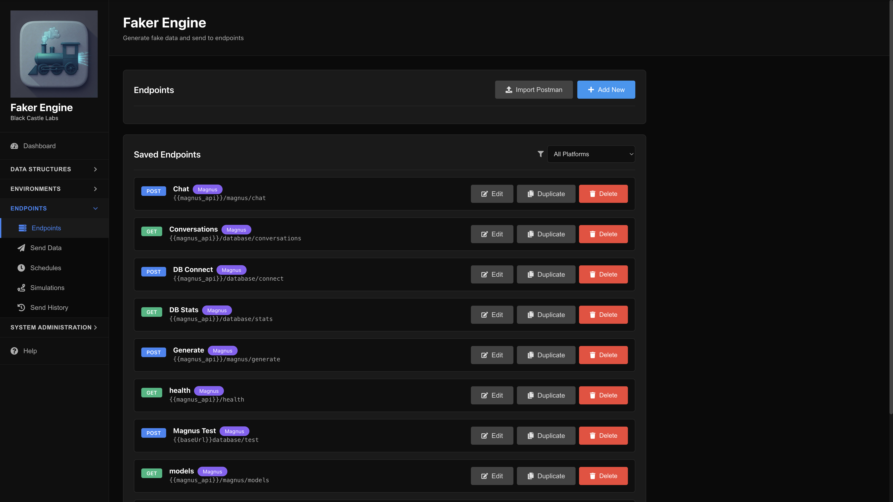
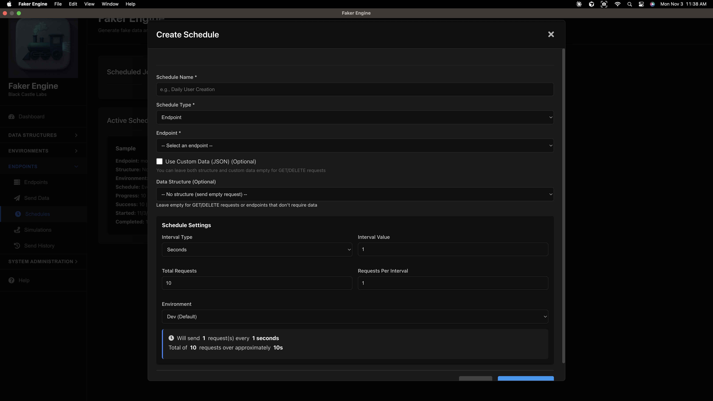
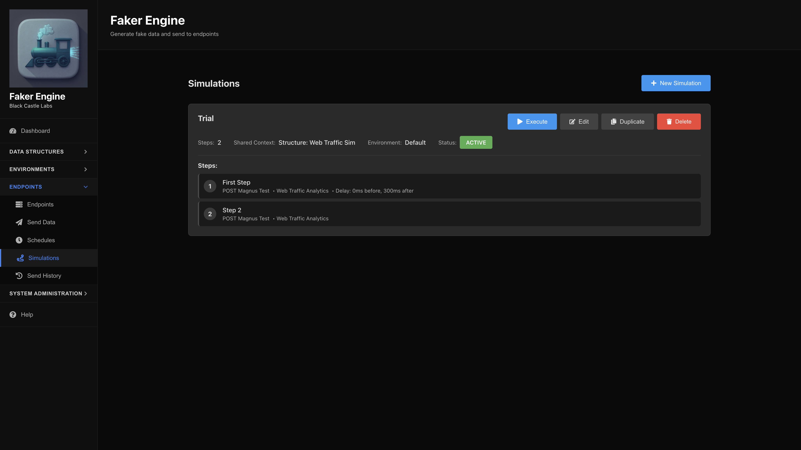

<!-- @format -->

# FakerEngine


A modern Electron desktop application for creating data structures, generating fake data, scheduling endpoint executions, and managing API testing workflows. Built with React and Node.js, featuring a beautiful dark UI theme.

## Features


- 🖥️ **Desktop Application** - Native Electron app for Windows, macOS, and Linux
- 🎨 **Modern Dark UI** - Beautiful, modern dark theme interface with accordion navigation
- 📊 **Data Structure Builder** - Create custom data structures with nested fields and arrays
- 🎲 **Fake Data Generation** - Generate realistic fake data using Faker.js
- 🏢 **Platform Management** - Organize endpoints by platform with environment variables
- 🌍 **Environment Configuration** - Manage environment-specific variables and configurations
- 🚀 **Endpoint Management** - Configure and manage multiple endpoints with authentication
- 📤 **Flexible Sending** - Send data using GET, POST, PUT, PATCH, or DELETE methods
- ⏰ **Scheduled Jobs** - Schedule endpoint executions and simulations to run automatically
- 🔄 **Simulations** - Create multi-step execution workflows
- 📜 **Send History** - Track and review all request/response history with detailed statistics
- 💾 **NeDB Storage** - Lightweight embedded database (no external database required)
- 🔍 **Database Viewer** - Directly browse and query your NeDB collections
- 📥 **Export/Import** - Backup and restore all your data
- 🔄 **Real-time Preview** - Preview generated data before sending
- 📊 **Dashboard** - Overview of statistics and recent activity

## Tech Stack

### Desktop Application

- **Electron** - Cross-platform desktop framework
- **electron-builder** - Packaging and distribution

### Backend

- **Node.js** with Express
- **NeDB** - Embedded NoSQL database (file-based)
- **@faker-js/faker** - Data generation library
- **Axios** - HTTP client

### Frontend

- **React 18**
- **React Icons** - Icon library
- **Modern CSS** - Dark theme with accordion navigation
- **Axios** - API communication

## Installation

### Prerequisites

- **Node.js** (v14 or higher)
- **npm** or **yarn**

### Setup

1. Clone the repository:

```bash
git clone <repository-url>
cd FakerEngineElectron
```

2. Install all dependencies:

```bash
npm run install-all
```

This will install dependencies for:

- Root (Electron and electron-builder)
- Backend (Express, NeDB, Faker.js, etc.)
- Frontend (React and related packages)

## Running the Application

### Development Mode

**Option 1: Using the run script (Recommended)**

```bash
./run.sh
```

This script will:

- Check and install dependencies if needed
- Build the frontend
- Start Electron (which automatically spawns the backend)

The backend server runs on `http://localhost:38765`

**Option 2: Manual Start**

1. Build the frontend:

```bash
npm run build-frontend
```

2. Start Electron:

```bash
npm start
# or for development mode:
npm run dev
```

### Production Build

Build for your platform:

```bash
# Build for current platform
npm run build

# Build for specific platforms
npm run build:mac      # macOS
npm run build:win      # Windows
npm run build:linux    # Linux
```

Built applications will be in the `dist/` directory.

## Usage

### 1. Platforms & Environments


- **Platforms**: Organize your endpoints by platform (e.g., Production, Staging, Development)
- **Environments**: Configure environment-specific variables per platform
  - Set default environment per platform
  - Use variables in URLs, headers, query params, and request data

### 2. Create Data Structures


- Navigate to **Configuration > Data Structures**
- Click "Create Structure" to define your data structure
- Choose field types: string, number, boolean, date, email, name, address, phone, url, uuid, array, or object
- Configure field properties (min/max, length, nested fields, etc.)
- Save your structure

### 3. Preview Generated Data


- Go to **Data Management > Preview Data**
- Select a saved structure
- Choose how many records to generate
- Click "Generate Data" to see the fake data

### 4. Configure Endpoints



- Navigate to **Configuration > Endpoints**
- Enter endpoint name and URL
- Select HTTP method (GET, POST, PUT, PATCH, DELETE)
- Configure authentication (Bearer Token, Basic Auth, API Key)
- Add custom headers, query parameters, and path parameters
- Set request body templates
- Associate with a platform
- Save the endpoint

### 5. Send Data

- Go to **Operations > Send Data**
- Select an endpoint
- Choose to use a structure or custom JSON data
- Select an environment (optional - uses platform default if not selected)
- Set the count (if using a structure)
- Click "Send Data"
- View results with success/failure status, response times, and full response data

### 6. Schedule Jobs



- Navigate to **Operations > Schedules**
- Create a schedule for endpoints or simulations
- Configure:
  - Interval type (seconds, minutes, hours)
  - Interval value
  - Total requests
  - Requests per interval
  - Scheduled start time (optional)
- Monitor progress with real-time statistics
- Restart completed schedules or reset statistics

### 7. Simulations



- Go to **Operations > Simulations**
- Create multi-step execution workflows
- Define steps with:
  - Endpoint to call
  - Data structure to use
  - Delays between steps
  - Conditional execution
  - Shared context across steps
- Execute manually or schedule as a job

### 8. View History


- Navigate to **Data Management > Send History**
- View all past executions with:
  - Success/failure statistics
  - Request/response details
  - Duration and response times
  - Filter by type, status, and result
- Review individual request responses
- Clear history when needed

### 9. Database Viewer

- Go to **System Administration > DB Viewer**
- Browse all NeDB collections
- Query documents with JSON filters
- View document details
- Useful for debugging and data inspection

### 10. Export/Import

- Navigate to **System Administration > Export / Import**
- Export all data to JSON for backup
- Import previously exported data
- Supports: Platforms, Environments, Endpoints, Data Structures, Simulations, Schedules, and History

## API Endpoints

The backend API runs on port **38765** (configurable via `PORT` environment variable).

### Health Check

- `GET /api/health` - Check backend status

### Structures

- `GET /api/structures` - Get all structures
- `GET /api/structures/:id` - Get single structure
- `POST /api/structures` - Create structure
- `PUT /api/structures/:id` - Update structure
- `DELETE /api/structures/:id` - Delete structure

### Platforms

- `GET /api/platforms` - Get all platforms
- `GET /api/platforms/:id` - Get single platform
- `POST /api/platforms` - Create platform
- `PUT /api/platforms/:id` - Update platform
- `DELETE /api/platforms/:id` - Delete platform

### Environments

- `GET /api/environments` - Get all environments
- `GET /api/environments/:id` - Get single environment
- `POST /api/environments` - Create environment
- `PUT /api/environments/:id` - Update environment
- `DELETE /api/environments/:id` - Delete environment

### Endpoints

- `GET /api/endpoints` - Get all endpoints
- `GET /api/endpoints/:id` - Get single endpoint
- `POST /api/endpoints` - Create endpoint
- `PUT /api/endpoints/:id` - Update endpoint
- `DELETE /api/endpoints/:id` - Delete endpoint
- `POST /api/endpoints/:id/send` - Send data to endpoint
- `POST /api/endpoints/:id/test` - Test endpoint connection

### Data Generation

- `POST /api/data/generate` - Generate fake data
  ```json
  {
  	"structureId": "structure_id",
  	"count": 10
  }
  ```

### Schedules

- `GET /api/schedules` - Get all schedules
- `GET /api/schedules/:id` - Get single schedule
- `POST /api/schedules` - Create schedule
- `PUT /api/schedules/:id` - Update schedule
- `DELETE /api/schedules/:id` - Delete schedule
- `POST /api/schedules/:id/start` - Start a schedule
- `POST /api/schedules/:id/reset` - Reset schedule statistics

### Simulations

- `GET /api/simulations` - Get all simulations
- `GET /api/simulations/:id` - Get single simulation
- `POST /api/simulations` - Create simulation
- `PUT /api/simulations/:id` - Update simulation
- `DELETE /api/simulations/:id` - Delete simulation
- `POST /api/simulations/:id/execute` - Execute simulation

### Send History

- `GET /api/send-history` - Get all history entries
- `GET /api/send-history/:id` - Get single history entry
- `DELETE /api/send-history` - Clear all history
- `GET /api/send-history/stats/summary` - Get history statistics

### Dashboard

- `GET /api/dashboard/stats` - Get dashboard statistics

### Database Viewer

- `GET /api/db/collections` - List all collections
- `GET /api/db/:collection` - Query collection
- `GET /api/db/:collection/:id` - Get single document

### Export/Import

- `GET /api/export-import/export` - Export all data
- `POST /api/export-import/import` - Import data

## Project Structure

```
FakerEngineElectron/
├── main.js                 # Electron main process
├── preload.js              # Electron preload script
├── faker-engine-icon.png   # Application icon
├── electron-builder.json   # Electron builder configuration
├── package.json            # Root package.json
├── run.sh                  # Development run script
├── backend/
│   ├── server.js           # Express server
│   ├── database.js         # NeDB initialization
│   ├── models/             # NeDB model classes
│   │   ├── DataStructure.js
│   │   ├── Endpoint.js
│   │   ├── Platform.js
│   │   ├── Environment.js
│   │   ├── ScheduledJob.js
│   │   ├── Simulation.js
│   │   └── SendHistory.js
│   ├── routes/             # API routes
│   ├── services/           # Background services
│   │   └── scheduler.js    # Job scheduler
│   └── utils/              # Utility functions
├── frontend/
│   ├── public/             # Static assets
│   ├── src/
│   │   ├── components/    # React components
│   │   │   ├── Sidebar.js
│   │   │   ├── Dashboard.js
│   │   │   ├── DataStructureBuilder.js
│   │   │   ├── PlatformManager.js
│   │   │   ├── EnvironmentManager.js
│   │   │   ├── EndpointManager.js
│   │   │   ├── EndpointSender.js
│   │   │   ├── ScheduleManager.js
│   │   │   ├── SimulationManager.js
│   │   │   ├── SendHistory.js
│   │   │   ├── DbViewer.js
│   │   │   └── ExportImport.js
│   │   ├── App.js
│   │   └── config.js      # API configuration
│   └── build/             # Production build output
└── data/                   # NeDB database files (development)
```

## Data Storage

The application uses **NeDB** (Embedded NoSQL Database) for storage:

- **Development**: Database files are stored in `./data/` directory
- **Production**: Database files are stored in OS-specific user data directories:
  - macOS: `~/Library/Application Support/FakerEngine/data/`
  - Windows: `%APPDATA%/FakerEngine/data/`
  - Linux: `~/.config/FakerEngine/data/`

Database files:

- `platforms.db` - Platform data
- `environments.db` - Environment configurations
- `endpoints.db` - Endpoint configurations
- `datastructures.db` - Data structure definitions
- `customdatatypes.db` - Custom data type templates
- `simulations.db` - Simulation definitions
- `scheduledjobs.db` - Scheduled job configurations
- `sendhistory.db` - Request/response history

## Field Types

- **string**: Random alphanumeric string
- **number**: Random integer (with min/max)
- **boolean**: True or false
- **date**: Recent date
- **email**: Random email address
- **name**: Full name
- **address**: Street address with city and country
- **phone**: Phone number
- **url**: URL
- **uuid**: UUID
- **array**: Array of values (configurable type)
- **object**: Object with nested fields

## Environment Variables

The backend can be configured with environment variables:

- `PORT` - Backend server port (default: 38765)
- `NODE_ENV` - Environment mode (development/production)
- `SKIP_BACKEND_START` - Skip automatic backend start in Electron (set to 'true')

## Scripts

- `npm run install-all` - Install all dependencies (root, backend, frontend)
- `npm run build-frontend` - Build React frontend
- `npm start` - Start Electron app
- `npm run dev` - Start Electron in development mode
- `npm run build` - Build for current platform
- `npm run build:mac` - Build for macOS
- `npm run build:win` - Build for Windows
- `npm run build:linux` - Build for Linux

## Building for Distribution

1. Update version in `package.json`
2. Build frontend: `npm run build-frontend`
3. Build for your platform: `npm run build:mac|win|linux`
4. Find distributables in `dist/` directory

## Troubleshooting

### Backend connection issues

- Ensure backend is running on port 38765
- Check firewall settings
- Verify no other application is using port 38765

### Database issues

- Check file permissions on database files
- Ensure disk space is available
- Verify database files aren't corrupted

### Build issues

- Clear `node_modules` and reinstall: `rm -rf node_modules backend/node_modules frontend/node_modules && npm run install-all`
- Clear build directory: `rm -rf frontend/build`
- Rebuild: `npm run build-frontend`

## License

ISC

## Contributing

Contributions are welcome! Please feel free to submit a Pull Request.

## Version

Current version: **1.1.3**
